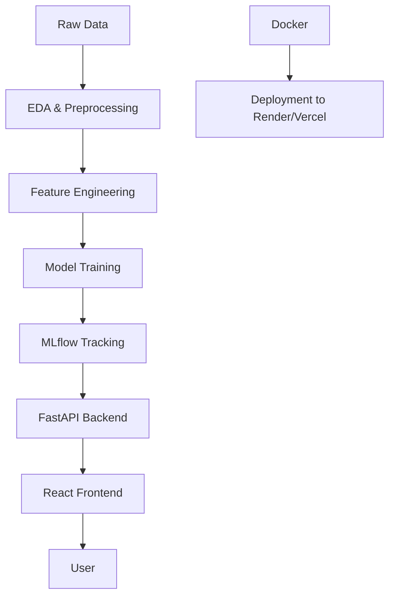

# 🇹🇳 Tunisia Car Price Predictor – Guided ML Project


---

# 📋 Course Overview

This repository contains the complete materials for the **Tunisia Car Price Predictor** project.

This is a **100% project-based course** where you will learn how to build, track, and deploy a **complete Machine Learning solution** for predicting car prices in Tunisia.

---

# 🚀 Project Synopsis

This repository provides a **full-stack Machine Learning project** that predicts car prices in Tunisia using real-world data.

The goal is to build an **ML application capable of estimating car prices with confidence intervals**.

The project covers:

- Data collection
- Data preprocessing
- Feature engineering
- Machine learning modeling
- Experiment tracking
- API development
- Frontend interface
- Docker containerization
- Cloud deployment

---

# ⚠️ Important

This repository is a **baseline example**.

Each team must:

- Choose their **own dataset**
- Define their **own objective**
- Get validation from the **course tutor before continuing**

---

# 🛠️ Installation & Setup

Clone the repository:

```bash
git clone https://github.com/your-username/tunisia-car-price-predictor.git
cd tunisia-car-price-predictor
```

---

## Install Backend Dependencies

```bash
cd code/tunisia-car-api
pip install -r requirements.txt
```

---

## Install Frontend Dependencies

```bash
cd ../client
npm install
```

---

# 📅 7-Week Roadmap

| Week | Topic |
|-----|------|
| Week 1 | Setup, Data Collection & EDA |
| Week 2 | Preprocessing & Feature Engineering |
| Week 3 | Modeling (Boosting) & MLflow |
| Week 4 | API Development (FastAPI) |
| Week 5 | Frontend Development (React) |
| Week 6 | Containerization (Docker) |
| Week 7 | Deployment & Final Review |

---

# 🏗️ Project Architecture



---

# 📁 Repository Structure

```
tunisia-car-price-predictor/
│
├── guide_projet.pdf        # Detailed project roadmap
├── README.md               # Project documentation
│
├── cours/                  # Course slides and materials
│
├── code/
│   ├── tunisia-car-api/    # FastAPI backend
│   │   ├── app/
│   │   ├── requirements.txt
│   │   └── Dockerfile
│   │
│   └── client/             # React frontend
│       ├── src/
│       └── package.json
│
├── tutos/                  # Step-by-step tutorials
│
├── data/
│   ├── raw/                # Raw Tunisia car dataset
│   └── processed/          # Cleaned dataset
│
```

---

# 🎯 How to Use This Repository

1️⃣ Clone the repository

```bash
git clone https://github.com/your-username/tunisia-car-price-predictor.git
```

2️⃣ Follow the tutorials in the **tutos/** folder.

3️⃣ Use the **code/** directory as a **reference structure** for your own project.

4️⃣ Replace the dataset in the **data/** folder with your own dataset.

---

# 🚀 Deployment

## 🐳 Backend Deployment (Render)

Push the code to GitHub:

```bash
git add .
git commit -m "Initial commit"
git push origin main
```

Deploy to Render:

1. Go to https://render.com
2. Click **New Web Service**
3. Connect your **GitHub repository**

Configuration:

```
Build Command:
docker build -t tunisia-car-api .

Start Command:
docker run -p 8000:8000 tunisia-car-api
```

Environment Variable:

```
PORT=8000
```

---

## 🎨 Frontend Deployment (Vercel)

Push the frontend code:

```bash
git add .
git commit -m "Initial commit"
git push origin main
```

Deploy:

1. Go to https://vercel.com/new
2. Import your GitHub repository
3. Vercel will **automatically build and deploy the React app**

---

# 📄 License

This project is licensed under the **MIT License**.

See the `LICENSE` file for more details.

---

# 👤 Author

**Your Name**

GitHub  
https://github.com/your-username  

LinkedIn  
https://linkedin.com/in/your-username  

Email  
your-email@example.com  

---

# 🎯 Final Notes

This project demonstrates a **complete production-ready ML pipeline** including:

✔ Machine Learning Engineering  
✔ Backend Development (FastAPI)  
✔ Frontend Development (React)  
✔ DevOps (Docker + Deployment)  

It is ideal for showcasing your skills to:

- Recruiters
- Clients
- Investors

⭐ If you like this project, consider **starring the repository**!
It’s perfect for showcasing your skills to recruiters, clients, or investors! 🚀

